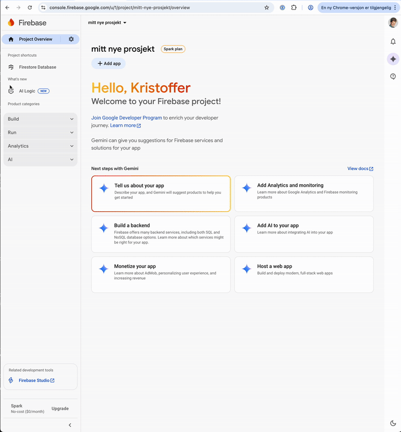

🏗️ Wizard builder for Losen
===

A **[losen](https://github.com/DirektoratetForByggkvalitet/losen) compliant wizard builder** for creating interactive, schema-driven wizards. It uses [Firebase Firestore](https://firebase.google.com/docs/firestore) as its backend for storing wizard definitions and state, with a custom Node.js API for serving schemas and assets. The frontend is bundled into the same container and served via NGINX.

## 📖 Introduction
The wizard builder lets organizations define and host guided workflows ("wizards") based on the losen standard.

- **Who it’s for**: Organizations that need to deploy self-service wizards for citizens, employees, or customers.
- **What it does**: Provides a builder interface, schema management, and runtime environment for losen-compliant wizards.
- **Why it matters**: Ensures compliance with the losen framework while offering flexibility through Firebase and Redis integration.


## 👷‍♀️ Getting Started (Development)
### Prerequisites
- Node.js runtime (use [`Volta ⚡️`](https://volta.sh/) for easy version management)
- [Java JDK](https://jdk.java.net/) 11+ (needed for [Firebase Local Emulator Suite](https://firebase.google.com/docs/emulator-suite)).
- Docker (optional, but needed if you want to build locally)

### Setup
```sh
npm install
npm run dev
```

## 🚀 Releasing new versions
Releasing new versions of the wizard builder is done like this:

- **Major release**: `npm run release:major`
- **Minor release**: `npm run release:minor`
- **Patch release**: `npm run release:patch`

It will
1. check that your working copy is clean
2. bump the version number in the root package.json
3. add a chore commit message for the version change
4. add a git tag for the new version
5. push the new tag + current branch to your remote

...which will in turn be built and pushed to Dockerhub by the Github actions pipe.

## 🔧 Environment variables
Depending on what you're trying to do, you'll want to either provide env vars to connect to your local firebase emulator (this is the default that is set up in the `.env.development`) or connect to a real firebase instance hosted by Google. For local dev, add your env vars to `/apps/api/.env.local`.

The firebase env vars partially refer to the Firebase **project** and the web app you create _in_ your Firebase project to represent the wizard builder application. See the video below for reference.



| Environemnt variable | Description | Production | Development |
| -------------------- | ----------- | ---------- | ----------- |
| `REDIS_URL` | Connection string for Redis cache. See [caching](#caching). On the format `rediss://...` | Recommended | Optional |
| `GOOGLE_APPLICATION_CREDENTIALS` | Base64 encoded service account JSON for the privileged access to firebase that the backend needs. | Required | - |
| `PUBLIC_FIREBASE_PROJECT_ID` | Firebase project id. You find this under «Project settings» in the Firebase console. | Required | Required |
| `PUBLIC_FIREBASE_APP_ID` | Firebase app id for the **web** project you've created in the firebase project. | Required | Required |
| `PUBLIC_FIREBASE_API_KEY` | Firebase API key for the web app in your firebase project. | Required | Required |
| `PUBLIC_FIREBASE_STORAGE_BUCKET` | Storage bucket for firebase storage. You find it under the web application settings, but usually it's `APP_ID.appspot.com` | Required | Required |
| `PUBLIC_FIREBASE_MESSAGING_SENDER_ID` | Firebase messaging sender ID. You find it under the web application settings. It's an 11 digit number. | Required | Required |
| `PUBLIC_FIREBASE_AUTH_DOMAIN` | The domain where your application is hosted. Without the protocol prefix (https://). | Required | Required |
| `PUBLIC_FIREBASE_AUTH_OIDC_PROVIDER_ID` | Optional Firebase OIDC provider ID used when setting up SSO. See [Setting up OIDC login](#setting-up-oidc-login). | Optional | Optional |
| `PUBLIC_FIREBASE_AUTH_OIDC_PROVIDER_NAME` | Optional Firebase OIDC provider name used when setting up SSO. See [Setting up OIDC login](#setting-up-oidc-login). | Optional | Optional |
| `PUBLIC_FIREBASE_AUTH_DOMAIN` | Optional Firebase OIDC auth domain used when setting up SSO. See [Setting up OIDC login](#setting-up-oidc-login). | Optional | Optional |

### Emulator setup in dev
If you want to point the wizard builder to a firebase emulator running locally, you have to set the following. When running in development using the `npm run dev` command the values from `.env.development` in the `/api` folder are loaded automatically. You can override by setting values in `apps/api/.env.local`.

| Environemnt variable | Description | Default |
| -------------------- | ----------- | ------- |
| PUBLIC_FIREBASE_EMULATOR_AUTH_HOST | Hostname, protocol and port to auth emulator | `http://localhost:9099` |
| PUBLIC_FIREBASE_EMULATOR_FIRESTORE_HOST | Hostname for the firestore database emulator | `localhost` |
| PUBLIC_FIREBASE_EMULATOR_FIRESTORE_PORT | Port number for the firstore database emulator | `8080` |
| PUBLIC_FIREBASE_EMULATOR_STORAGE_HOST | Hostname for the firebase storage emulator | `localhost`|
| PUBLIC_FIREBASE_EMULATOR_STORAGE_PORT | Port number for the firebase storage emulator | `9199`|

## 🐳 Building and running with docker
The applications can be built and bundled with docker by doing `npm run build:docker` or `docker build .` if you prefer that. In short it will

1. build the frontend and api
2. build an image that contains a node runtime and a nginx server
3. configure the nginx server to serve the frontend and serve the api through a proxy on `/api`

After building the image you will, when starting the app, need to map port `80` to something on your host machine and provide the necessary [environment variables](#environment-variables).

You would typically start the container by doing something along the lines of:

```sh
docker run -p 8181:80
  -e PUBLIC_FIREBASE_API_KEY=...
  -e PUBLIC_FIREBASE_APP_ID=abc123
  losen-veiviserbygger
```

## Takin' it to production

### 📦 Building for production
Docker images for the wizard builder is [automatically built](https://github.com/DirektoratetForByggkvalitet/veiviserbygger/actions/workflows/docker-build.yml) on every push to the main branch and pushed to [ghcr.io](https://github.com/DirektoratetForByggkvalitet/veiviserbygger/pkgs/container/veiviserbygger).

> Later, when we push them to someplace public you can pull the image from dockerhub like every other image.

### 🏃‍♂️ Using the public image
Pull the docker image `ghcr.io/direktoratetforbyggkvalitet/veiviserbygger`, bind the desired host port to container port `80` and pass env vars as specified under [environment variables](#firebase-hosted-by-google). An example

```sh
docker run -p3333:80
  -e PUBLIC_FIREBASE_API_KEY=...
  -e PUBLIC_FIREBASE_APP_ID=abc123
  ghcr.io/direktoratetforbyggkvalitet/veiviserbygger
```

### ⚙️ Firebase
In production you need to connect the wizard builder to a Firebase project. After creating the project you need to add a firestore database to the project and add a web app to the project by clicking «+ Add app» on the Project overview for your project. A web app in this context represents a web based application that interacts with the firebase project.

#### Security rules
You need to set the security rules for your firestore database and the storage service.

##### Firestore
Since this is a single tenant service at the moment, meaning that each organization will deploy their own firestore database and server, we allow anyone who've authenticated to see and edit everything under `/wizards/` in the database.

```
rules_version = "2";

service cloud.firestore {
  match /databases/{database}/documents {
    match /wizards/{document=**} {
      allow read, write: if request.auth != null
    }
  }
}
```

##### Storage
Only authenticated users should be allowed to add/edit/remove files in the storage service, but anyone should be able to see the files, since these are uploaded to be shown in the publicly available wizards.

```
rules_version = '2';

service firebase.storage {
  match /b/{bucket}/o {
    match /{allPaths=**} {
      allow write: if request.auth != null;
      allow read: if true;
    }
  }
}
```

### ⚡️ Performance (caching)
When running in production you don't want to be hitting firestore every time someone visits one of the wizards. To avoid this we cache the schema for a wizard for 60s using Redis. You should set up a Redis instance available to the wizard builder api. After setting it up, add the following environment variable to the api container: `REDIS_URL=redis://....`.

### 🔑 Single sign on (OIDC)
While managing users through the authentication page in the Firebase console is possible, it is often not the most practical solution for larger orgs. If you have an identity provider in you organization that supports OIDC you can manage users with access to the wizard builder from your own identity provider.

Steps:
1. In your IDP
    1. Create an OIDC client
    2. Add `https://your-app-domain.com/__/auth/handler` to the list of allowed redirect URLs for the client
2. In the Firebase console
    1. Add a new OIDC provider by going to the Firebase console > Autentication > Sign-in method and clicking «Add new provider»
    2. Click OpenID Connect and click to enable OpenID Connect at the top
    3. Enter a name; the client id, issuer url and the secret for your OIDC client
    4. Make a note of the Provider ID (below the name field) – you'll need this later
3. Add the following environment variables to the wizard builder env:
    - `PUBLIC_FIREBASE_AUTH_OIDC_PROVIDER_ID=oidc....` – This is the provider id from 2.4
    - `PUBLIC_FIREBASE_AUTH_OIDC_PROVIDER_NAME="My Org Name"` – This is the name that will show on the login button. Like: _Logg inn med XXX_.
    - `PUBLIC_FIREBASE_AUTH_DOMAIN=your-app-domain.com` – No protocol or trailing slash.

After restarting your container/application the option of logging in using the OIDC provider should appear and the users you allow should be able to log in.

### 🦺 Embeds and Content Security Policy
When embedding wizards from the builder on your own website you might need to adjust your Content Security Policy (CSP). The CSP is there to protect the visitors on your site against various attack vectors and a large part of that is instructing the browser to prevent fetching and execution of scripts and resources from other domains.

The wizard builder will most likely reside on a different domain than your site, and consequently you will need to adjust the CSP if you have one. In order for the wizard builder to work, the following needs to be allowed:

1. Add `https://your-app-domain.com` to `connect-src` and `script-src`.
2. Add `'unsafe-inline'` to `style-src`
3. Add `https://storage.googleapis.com/your-storage-bucket-name/` to `img-src`. The `your-storage-bucket-name/` part should be replaced with the name of your storage bucket, or optionally omitted if you're ok allowing images from any bucket on Google storage.

# License

See [LICENSE](./LICENSE.md) file.
